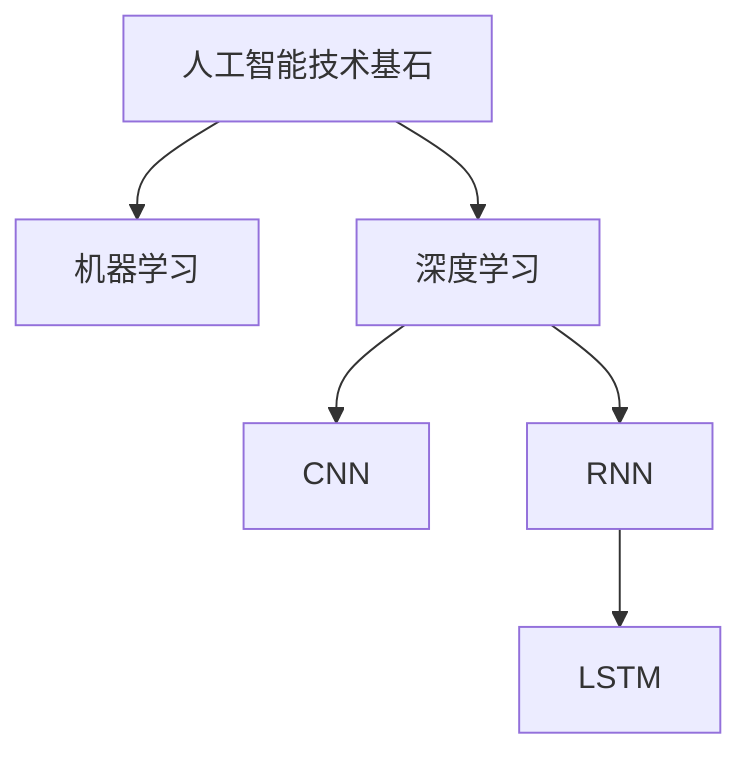
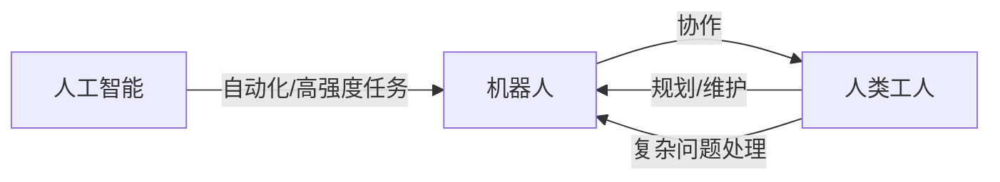
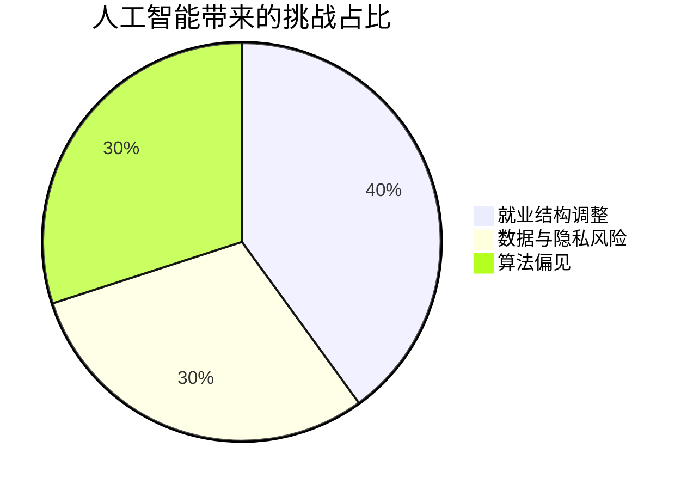

# 人工智能是否会代替人类？——多维度剖析与未来展望

> 作者：Hu Zhi Wen

---

## 一、引言

在当今科技飞速发展的时代，人工智能（Artificial Intelligence，简称 AI）已成为最具变革性力量的领域之一。从 AlphaGo 战胜围棋世界冠军，到智能语音助手融入日常对话，从自动驾驶汽车逐步上路，到医疗领域中辅助诊断系统的应用，人工智能的身影无处不在。

随之而来的是人们对于 “人工智能是否会代替人类” 这一命题的广泛探讨与深度担忧。作为一名对科技发展保持密切关注与思考的探索者，Hu Zhi Wen 试图从多维度剖析这一复杂议题，探寻人工智能与人类在未来世界的关系走向。

---

## 二、人工智能的发展现状与能力边界

### 1. 当前人工智能的技术基石

- **机器学习（Machine Learning）**：通过数据学习规律，实现对未知数据的预测与判断。
- **深度学习（Deep Learning）**：模拟人脑神经网络，在图像识别、自然语言处理等领域取得突破。
    - **卷积神经网络（CNN）**：擅长图像分类。
    - **循环神经网络（RNN）与 LSTM**：处理序列数据，如文本、语音等。

### 2. 人工智能的能力表现与边界

- **优势领域**：
    - 数据处理：高效、精准
    - 图像识别：准确率高
    - 医学诊断：辅助医生
    - 语言翻译：便利跨语交流

- **能力边界**：
    - 缺乏自主意识与情感体验
    - 艺术创作难以超越人类灵感
    - 道德抉择依赖预设规则，无法如人类般权衡

---

## 三、人类的独特优势：不可替代的特质

| 特质             | 描述                                                         | AI 是否具备 |
|------------------|--------------------------------------------------------------|:-----------:|
| 主观意识         | 感知自我存在、思考生命意义                                    | ✗           |
| 情感体验         | 体验喜怒哀乐、共情、鼓励                                      | ✗           |
| 创造力与创新思维 | 好奇心、思想跃迁、价值赋予                                   | ✗           |
| 道德伦理判断     | 社会共识、文化传承、伦理抉择                                 | ✗           |

### 1. 意识与情感的主体性

- 人类能感知自我和世界，体验丰富情感，构建多元文化与价值体系。
- 情感是团队协作、教育关怀的核心。

### 2. 创造力与创新思维

- 人类不断突破认知边界，创造前所未有的新事物。
- AI 只能重组已有知识，难有“从无到有”的思想跃迁。

### 3. 道德与伦理的判断主体

- 人类社会有复杂动态的伦理体系。
- AI 决策依赖预设程序，缺乏自主伦理判断。

---

## 四、人工智能与人类的协作共生路径

### 1. 生产领域协同

- **AI + 机器人**：自动化流水线高效运转
- **人类工人**：流程规划与复杂问题处理

### 2. 科研创新互补

- AI 辅助数据处理、模拟筛选
- 人类主导理论推导、创新方向

### 3. 教育与文化传承融合

- AI 实现个性化学习
- 教师激发兴趣、人格塑造
- AI 助力文物修复、古籍数字化
- 文化传承与创新需人类参与

---

## 五、人工智能发展的反思与人类应对

### 1. 挑战

- 就业结构调整，部分岗位被取代
- 数据安全与隐私风险
- 算法偏见导致歧视性决策

### 2. 主动应对策略

- 技术层面：加强可解释性研究，构建伦理框架
- 社会层面：完善教育体系，培养创新与人文素养
- 文化层面：强化人类价值认知，弘扬人文精神

---

## 六、结论：人工智能与人类的未来图景

- 人工智能虽强大，但**无法替代人类**。
- 人类拥有“意识、情感、创造力、道德伦理”壁垒。
- 未来，AI 与人类将**协作共生，互补融合**，共同推动社会进步。
- 我们应理性看待 AI，拥抱机遇，坚守尊严，探索人机和谐共生的美好未来。

---

> **人类与人工智能的关系，不是你死我活，而是携手迈向更高维度的社会文明。**