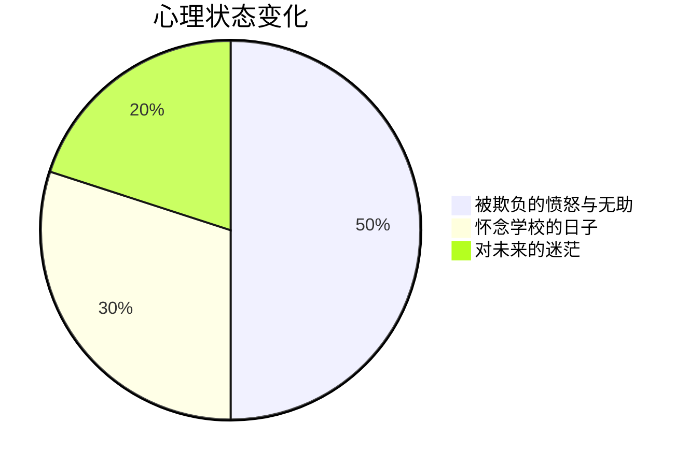

# 我的故事

---

## 2025年5月～6月

其实，这个世界是不公平的。  
没有什么是公平的，我要说我的故事。

从小，我被人欺负，一直到初三，依然被人欺负。  
小学时，有人在我头上撒尿。到了初中，虽然不是同一个人，但依旧被欺负。我班里的一个叫李伟峰，一个叫杨一帆的人，成为了新的欺负我的人。  
小学的事情就不提了，现在欺负我的那个人叫赵利县，他现在害怕我了。

到了初三，也就是现在，五月份的时候，我报了警，但由于证据不足，警察最后没有管。校长还对警察说我是个“傻子”（心理障碍），甚至说我“不是什么好种”。校长还对我说：“以后别报警了。”我觉得他只是嫌我影响学校声誉。

李伟峰后来知道我报警，说不再欺负我了。可是到了星期五，也就是昨天，他又打了我。他说如果我把他弄倒，他就不会再打我了。可是即使我把他弄倒了，他还是打我，疼得缓了好几分钟才恢复。他只欺负弱者，不欺负强者。

回到家后，我哥又打了我。李伟峰还把我的书拿去卖了，虽然应该还没卖，但他放在他家里。我让他别卖，他却说给我买点零食就好了。我不同意，最后我拿订书针在手腕上划了几下，划出了血，伤口不大，但像刀割一样疼。后来，我洗掉了血，但伤口结了痂。

星期四的时候，我甚至冒出自杀的念头，但最后想了想，放弃了这个想法。  
我觉得，如果能变得强大就好了。可是我做不到。于是我只能默默忍受，等待初三毕业。

---

## 2025年6月18日

现在已经毕业了，只剩下参加中考了，考试时间是6月21日至23日。  
这一周内，李伟峰还在打我。而那个姓杨的，虽然是初二的，现在不打我了。李伟峰有时候还是会欺负我。今天，他用喷壶在我上厕所的时候对我喷了几下，我骂了他，他又喷了我。

周五上午，我去学校安排住宿，住的是宾馆，并交了400元的住宿费、伙食费和车费。  
义务教育阶段已经结束了，后续有的人会继续上学，有的人会去上技校，还有的人会混社会。老师告诉我：“学习不是唯一的出路，但学习能让你有更多的选择。”

---

## 2025年6月23日

在宿舍，李伟峰又打了我。杨一帆也对我施暴。  
在酒店的三天过得非常糟糕。今天考试时，有警察在现场，李伟峰就不敢打我了，他怕警察。

在酒店，我试图反抗，可是失败了。我真的很弱，像人们口中的“菜鸟”。  
杨一帆个子比我低，但我打不过他。他的拳头让我扛不住。李伟峰和我个子差不多，但他很强。他说他爸认识警察，所以举报他也没用。

有一次，他甚至在宿舍里脱了我的裤子，而我因为太热，也脱了上衣。当时宿舍只有几个人，准确来说是酒店房间。我举报了杨一帆，但还没举报李伟峰。

---

## 2025年8月4日

现在好多了，至少没有他们了。  
不过，我也怀念学校的日子。

时间过得很快，记得当时看《哪吒之魔童降世》的时候，想着《哪吒2》还要等很久才能上映。没想到，时间就这样飞快地过去了。

有人说：“人心是最可怕的。”我觉得这是真的，人心比鬼更可怕。

---

## 数据分析

### 被欺负的时间分布

| 时间        | 事件描述                              |
|-------------|---------------------------------------|
| 2025年5月  | 被李伟峰、杨一帆欺负，报了警但无果。    |
| 2025年6月  | 中考前，仍然被欺负，试图反抗但失败。    |
| 2025年8月  | 毕业后，生活逐渐好转，开始怀念学校生活。 |

### 心理状态变化

### 反思与收获

| 反思            | 收获                  |
|-----------------|-----------------------|
| 世界没有绝对的公平。 | 学习不是唯一的出路。      |
| 人心比鬼更可怕。   | 时间会冲淡一切。         |
| 变强大才不会被欺负。 | 生活有苦有甜，终会好起来。 |

---

## 人生的意义

尽管人生充满了坎坷，我依然相信，生活会越来越好。  
希望未来的我，能够变得更强大。