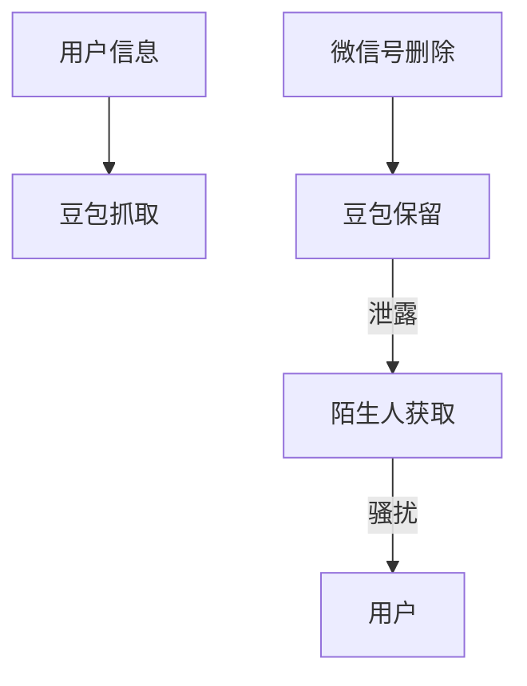
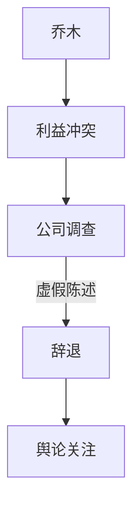
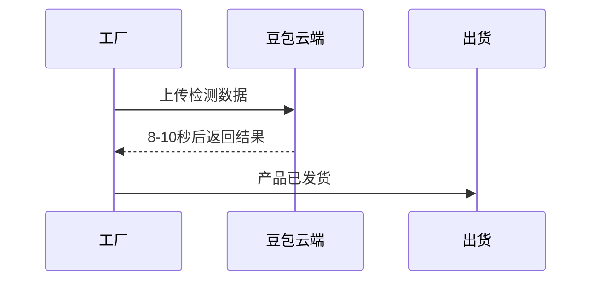

# 豆包大模型的争议与问题：从隐私泄露到道德危机

*——深度求索出品*

近年来，字节跳动推出的豆包大模型作为国内AI领域的“网红产品”，在快速扩张的同时也暴露出诸多问题。从技术缺陷到隐私泄露，从道德危机到商业泡沫，这款被寄予厚望的大模型产品正面临前所未有的信任危机。本文将梳理豆包主要争议，分析深层原因，并探讨AI产品应如何平衡技术创新与社会责任。

---

## 目录

1. [技术缺陷与用户体验问题](#技术缺陷与用户体验问题)
2. [隐私泄露与数据安全](#隐私泄露与数据安全)
3. [商业泡沫与流量霸权](#商业泡沫与流量霸权)
4. [道德危机与人事丑闻](#道德危机与人事丑闻)
5. [智能育儿产品安全隐患](#智能育儿产品安全隐患)
6. [边缘计算的缺失](#边缘计算的缺失)
7. [总结与反思](#总结与反思)

---

## 技术缺陷与用户体验问题

豆包大模型在营销层面投入巨大，但实际用户体验却饱受诟病。多模态能力和文案生成质量差、基础能力不足、功能堆砌明显。

### 用户评价示例

| 功能            | 用户评价                 |
| --------------- |-------------------------|
| 文案生成        | “质量堪比小学生作文”    |
| 多模态识别      | “猫咪被识别成吃火锅的狗” |
| 视频生成        | “动作像PPT翻页”         |
| 智能体定制      | “对话机械重复”           |

> “今天天气真好”——定制虚拟女友的机械式答复

---

## 隐私泄露与数据安全

豆包在处理用户隐私数据方面存在严重问题，甚至有用户被泄露微信号和联系方式。即便信息已删除，豆包依然保留和传播。

**法律观点：**
- 公开信息不应永久使用；
- 未申报利益冲突，构成违法收集个人信息。

---

## 商业泡沫与流量霸权

豆包大模型重营销轻技术，广告投入远超技术研发，用户留存率低。A股市场相关概念股暴涨，实际合作却存疑。

### 广告投放与留存率

| 月份      | 投放金额（万元） | 日均新增下载 | 三日留存率 |
|-----------|------------------|--------------|------------|
| 2024年4-5 | 1800             | 80万         | 28%        |
| 2024年6   | 12400            |              |          |

> “用1.24亿元制造增长幻觉”

---

## 道德危机与人事丑闻

2025年，豆包负责人乔木因与HRBP存在利益冲突被辞退。事件涉及婚内出轨、隐瞒资产、拒绝支付抚养费等，严重损害公司声誉。

- 2024年字节跳动全年辞退违规员工353人
- 移交司法机关39人
- 豆包事件因高调和家庭伦理引发广泛讨论

---

## 智能育儿产品安全隐患

豆包推出的“AI哄娃神器”多次误判幼儿情绪，导致安抚失效甚至安全事故。设备传感器精度低，情绪数据库样本少，缺乏医学验证。

### 安全风险图表

| 风险类型     | 占比  | 说明                   |
|--------------|-------|------------------------|
| 未取得医疗认证 | 67%   | 市场调查数据            |
| 诱导式应答   | 43%   | 语音交互风险            |
| 算法未经校准 | 89%   | 儿童心理专家未参与       |

> “婴儿出现触觉迟钝”“误判癫痫为剧烈运动”——实际安全事故频发

---

## 边缘计算的缺失

豆包过度依赖云端计算，导致AI在实际应用场景中出现延迟与失灵。边缘设备缺乏智能，影响工业、医疗等领域应用。

---

## 总结与反思

豆包大模型的问题，反映中国AI产业的深层矛盾：

1. **技术实力与营销投入失衡**：广告制造增长幻觉，技术创新不足。
2. **隐私保护机制缺失**：过度收集个人数据，缺乏有效治理。
3. **高管道德风险**：技术精英缺乏制衡，伦理危机频发。
4. **产品安全标准缺失**：儿童AI产品无严格准入机制。
5. **架构设计缺陷**：过度依赖云端，忽视边缘计算。

> “流量堆不出好产品，AI需要‘真功夫’”——这是对豆包争议最精辟的总结，也是对整个AI行业最诚恳的忠告。

---

**未来展望**  
AI产品需平衡技术创新与社会责任，建立严格隐私机制与道德准则，重视边缘计算，真正服务于人类需求，而非成为资本游戏或隐私威胁。